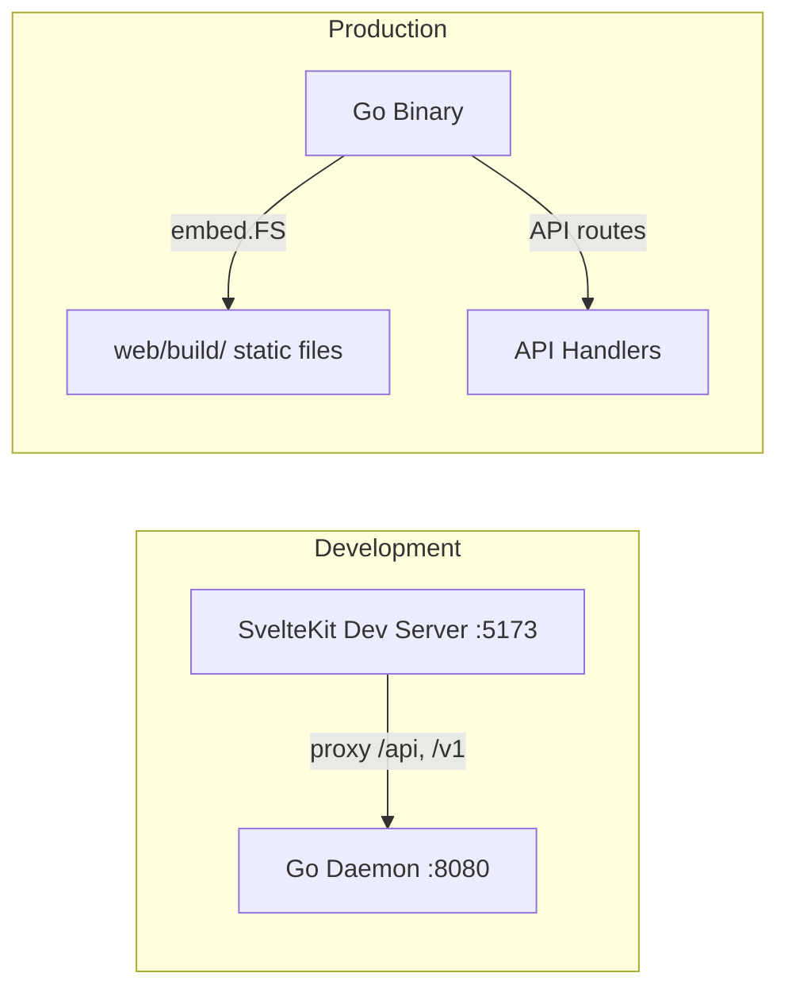

# Dashboard SvelteKit 5 Overhaul

## Architecture




- `**web/**` at project root: SvelteKit 5 app with `@sveltejs/adapter-static`
- Static adapter outputs to `internal/web/dist/` so Go can embed it directly
- During development, Vite proxies `/api/*` and `/v1/*` to the Go daemon
- In production, Go serves the pre-built static files via `embed.FS` alongside API routes

## 1. Scaffold the SvelteKit App

Create in `web/` directory using `pnpm`:

```bash
pnpm dlx sv create web --template minimal --types ts --no-add-ons --install pnpm
cd web
pnpm add -D @sveltejs/adapter-static
pnpm dlx shadcn-svelte@latest init
pnpm add @lucide/svelte
```

Configure `web/svelte.config.js`:

- Use `adapter-static` with output to `../internal/web/dist`
- Set `trailingSlash: 'always'` and `fallback: 'index.html'`

Configure `web/vite.config.ts`:

- Add proxy for `/api`, `/v1`, `/healthz` to `http://localhost:8080`

## 2. Add shadcn-svelte Components

Install the components we need (via CLI):

- **Layout:** `sidebar`, `separator`, `button`, `badge`, `tooltip`
- **Data:** `table`, `card`, `skeleton`
- **Feedback:** `sonner` (toast), `alert`, `dialog`, `spinner`
- **Forms:** `input`, `textarea`, `select`, `label`, `switch`
- **Navigation:** `tabs`, `dropdown-menu`, `command` (for search)

## 3. SvelteKit Routes and Pages

```
web/src/routes/
  +layout.svelte           # Sidebar layout with nav, dark mode toggle
  +page.svelte             # Overview dashboard (stats, recent activity)
  sessions/
    +page.svelte           # Sessions list with search/filter, create dialog
  workspaces/
    +page.svelte           # Workspaces list with delete
  settings/
    +page.svelte           # YAML config editor (improved)
```

### Shared API Client (`web/src/lib/api.ts`)

Typed fetch wrapper for all endpoints:

- `getStatus()` - `GET /api/status`
- `getSessions()` - `GET /v1/sessions`
- `getSession(id)` - `GET /v1/sessions/{id}`
- `createSession(opts)` - `POST /v1/sessions`
- `destroySession(id)` - `DELETE /v1/sessions/{id}`
- `execCommand(id, cmd)` - `POST /v1/sessions/{id}/exec`
- `getWorkspaces()` - `GET /v1/workspaces`
- `deleteWorkspace(id)` - `DELETE /v1/workspaces/{id}`
- `getConfig()` / `saveConfig()` / `validateConfig()` - config endpoints
- `getPoolStatus()` - `GET /api/status` (pool data included)

### Page Details

**Overview (`+page.svelte`)**

- Stats cards: Total Sessions, Active, Expired, Destroyed, Uptime
- Pool status card (per-image current/target with progress bars)
- Recent sessions mini-table (last 5)
- Quick action buttons (Create Session)

**Sessions (`sessions/+page.svelte`)**

- Search bar + status filter (all / running / expired / destroyed)
- Data table with columns: ID (copy-able), Image, Status (badge), Workspace, Created (relative), Expires (relative), Last Activity, Actions
- "Create Session" dialog (image select, TTL, workspace)
- "Destroy" button with confirmation dialog
- Click row to expand session detail drawer/sheet

**Workspaces (`workspaces/+page.svelte`)**

- Table: ID, Created, Size, Labels, Linked Sessions, Actions
- Delete workspace with confirmation

**Settings (`settings/+page.svelte`)**

- YAML editor textarea with monospace font
- Save / Reload / Validate buttons with toast feedback
- Config reference in collapsible section
- Restart-required warning banner

### UX Features (across all pages)

- **Toast notifications** via Sonner (replace `alert()`)
- **Relative timestamps** ("2m ago") with tooltip showing full date
- **Copy to clipboard** on session/workspace IDs
- **Loading skeletons** while data loads
- **Auto-refresh** with a visible countdown timer + manual refresh
- **Dark/light mode** toggle (persisted to localStorage)

## 4. Go Backend Changes

### Update `internal/web/handlers.go`

Replace embedded HTML with embedded SvelteKit build output:

```go
//go:embed all:dist
var distFS embed.FS

func (h *Handler) ServeSPA(w http.ResponseWriter, r *http.Request) {
    // Serve from embedded dist/ filesystem
    // Fall back to index.html for SPA client-side routing
}
```

- Remove `statusHTML` and `settingsHTML` embed directives
- Remove `ServeStatusPage` and `ServeSettingsPage`
- Add `ServeSPA` that serves static files with SPA fallback
- Keep all JSON API handlers (`GetStatus`, `GetConfig`, `UpdateConfig`, `ValidateConfig`)

### Add Pool Status to `/api/status`

Add a `Status()` method to `Pool` in [internal/pool/pool.go](internal/pool/pool.go):

```go
type PoolStatus struct {
    Enabled bool                    `json:"enabled"`
    Images  map[string]ImageStatus  `json:"images"`
}
type ImageStatus struct {
    Target  int `json:"target"`
    Current int `json:"current"`
}
```

Pass pool reference to `web.Handler` so `GetStatus` can include pool info in its response.

### Update Router ([internal/api/router.go](internal/api/router.go))

- Replace `GET /` and `GET /settings` with a catch-all SPA handler
- Add static asset serving for `/_app/*` (SvelteKit's asset path)
- Update auth middleware to skip auth for all static asset paths

### Update Auth Middleware ([internal/api/middleware.go](internal/api/middleware.go))

- Add path prefix check: skip auth for paths starting with `/_app/` and other static file extensions
- Keep existing API auth logic unchanged

## 5. Taskfile Updates ([Taskfile.yml](Taskfile.yml))

Add `web` task and make `daemon` depend on it:

```yaml
web:
  desc: Build the web frontend
  dir: web
  cmds:
    - pnpm install
    - pnpm build

daemon:
  desc: Build the sandkasten daemon
  deps: [web]
  cmds:
    - go build -o bin/sandkasten ./cmd/sandkasten
```

The `daemon` task now depends on `web`, ensuring the frontend is built before Go embeds it.

## 6. Delete Old Templates

Remove:

- `internal/web/templates/status.html`
- `internal/web/templates/settings.html`
- `internal/web/templates/` directory

