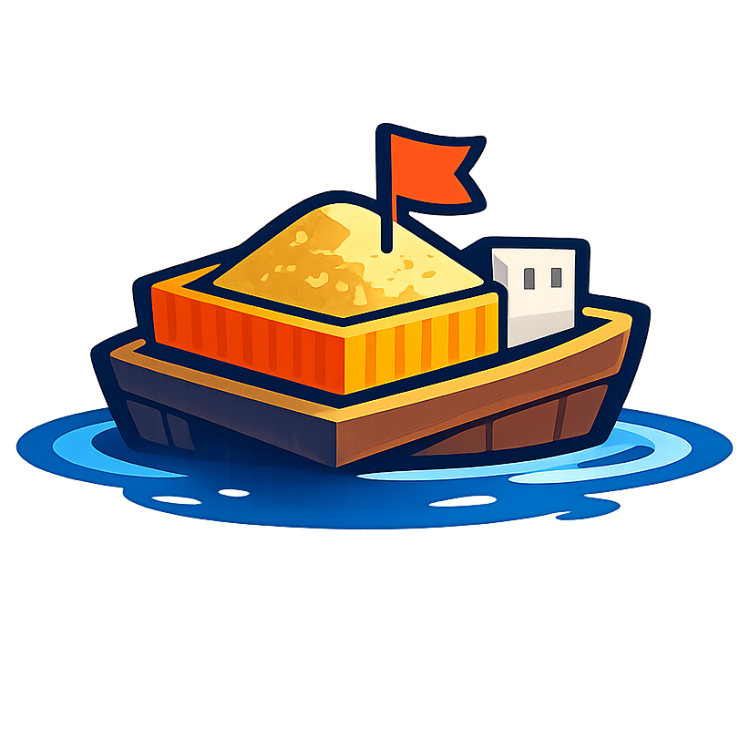

<div align="center">
  
</div>

<h1 align="center">Sandkasten</h1>

<p align="center">
  <strong>Self-hosted sandbox runtime for AI agents.</strong><br>
  Stateful Linux sandboxes with persistent shell, file operations, and workspace management — no Docker required.
</p>

<p align="center">
  
  
  
</p>

---

## Try it

```python
from sandkasten import SandboxClient

async with SandboxClient(base_url="...", api_key="...") as client:
    async with await client.create_session() as session:
        await session.write("hello.py", "print('Hello from sandbox!')")
        result = await session.exec("python3 hello.py")
        print(result.output)  # Hello from sandbox!
```

## Features

- ✅ **Stateful Sessions** - Persistent bash shell (cd, env vars, background processes)
- ✅ **No Docker** - Native Linux sandboxing with namespaces, cgroups, overlayfs
- ✅ **File Operations** - Read/write files in `/workspace`
- ✅ **Multiple Runtimes** - Python, Node.js, or custom images
- ✅ **Persistent Workspaces** - Directories that survive session destruction
- ✅ **Session Pool** - Pre-warmed sessions for sub-100ms create latency (optional)
- ✅ **Python + TypeScript SDKs** - Clean async APIs
- ✅ **Agent-Ready** - Works with OpenAI Agents SDK, LangChain, etc.
- ✅ **WSL2 Support** - Run on Windows via WSL2

## Requirements

- **Linux** with kernel 5.11+ (or WSL2 with Ubuntu 22.04+)
- cgroups v2 mounted at `/sys/fs/cgroup`
- overlayfs support

> [!NOTE]
> macOS is not supported. Use a Linux VM or WSL2.

---

## Quick Start

Three ways to get running — pick whichever fits your setup.

### Option A: Docker (30 seconds, no build needed)

```bash
docker run -d --privileged --name sandkasten \
  -p 8080:8080 \
  -v sandkasten-data:/var/lib/sandkasten \
  ghcr.io/p-arndt/sandkasten:latest \
  /bin/sandkasten up
```

That’s it. The container auto-initializes, pulls a Python image, generates an API key, and starts the daemon. Check the logs for your API key:

```bash
docker logs sandkasten 2>&1 | grep "API key"
```

Or use `docker compose` with the standalone file (no repo clone needed):

```bash
curl -O https://raw.githubusercontent.com/p-arndt/sandkasten/main/docker-compose.standalone.yml
docker compose -f docker-compose.standalone.yml up -d
# Default API key: sk-sandkasten
```

### Option B: Install binary (60 seconds)

```bash
curl -fsSL https://raw.githubusercontent.com/p-arndt/sandkasten/main/scripts/install.sh | sudo bash
sudo sandkasten up
```

`sandkasten up` is a zero-config command that:
- Checks your environment (kernel, cgroups, overlayfs)
- Creates data directories in `/var/lib/sandkasten`
- Pulls a Python sandbox image
- Generates an API key and prints it
- Starts the daemon on `localhost:8080`

### Option C: Build from source

```bash
git clone https://github.com/p-arndt/sandkasten
cd sandkasten
task build
sudo ./bin/sandkasten up
```

This produces `bin/sandkasten`, `bin/runner`, and `bin/imgbuilder`, then starts with zero config.

### Verify

```bash
curl http://localhost:8080/healthz
```

### Advanced setup

For full control, you can still use the traditional step-by-step approach:

```bash
./bin/sandkasten doctor                                    # check environment
sudo ./bin/sandkasten init --config sandkasten.yaml        # bootstrap config + data dirs
sudo ./bin/sandkasten image pull --name python python:3.12-slim  # pull images manually
sudo ./bin/sandkasten --config sandkasten.yaml             # start daemon
```

See [Configuration](./docs/configuration.md) for all options.

### Auto-pull images

Sandkasten auto-pulls images from OCI registries when they're requested but not available locally. Supported well-known images:

| Name | OCI Reference |
|------|---------------|
| `python` | `python:3.12-slim` |
| `node` | `node:22-slim` |
| `base` | `alpine:latest` |
| `ubuntu` | `ubuntu:24.04` |
| `golang` | `golang:1.25-alpine` |
| `ruby` | `ruby:3.3-slim` |
| `rust` | `rust:1-slim` |

Auto-pull is enabled by default. To disable: `auto_pull: { enabled: false }` in config or `SANDKASTEN_AUTO_PULL=false`.

### Benchmark Sandkasten vs Docker

Use `sandbench` to benchmark startup latency, CPU, and memory with a reproducible report that includes host hardware details. It supports:

- cold and warm prepooled Sandkasten session creation
- existing Sandkasten sessions (exec/stats without create)
- workspace scenarios (`none`, `shared`, `per-run` / fresh environment)
- Docker runs in the same style for direct comparison

```bash
# Build the benchmark tool
task sandbench

# Sandkasten benchmark (cold + warm + workload)
./bin/sandbench --host http://127.0.0.1:8080 \
  --image python \
  --cold-runs 3 --warm-runs 3 \
  --workload "python3 -m pip install requests"

# Benchmark existing sessions too
./bin/sandbench --host http://127.0.0.1:8080 \
  --existing-session-ids "sess1,sess2" \
  --existing-ping-cmd "python3 -V"

# Fresh workspace per run (new environment each run)
./bin/sandbench --host http://127.0.0.1:8080 \
  --workspace-mode per-run \
  --workload "python3 -m pip install numpy"

# Direct comparison: Sandkasten + Docker on same machine
./bin/sandbench --target both \
  --host http://127.0.0.1:8080 --image python \
  --docker-image python:3.12-slim \
  --workload "python3 -m pip install requests"

# JSON output for dashboards/CI
./bin/sandbench --target both --image python --docker-image python:3.12-slim --json

# Fully fresh benchmark campaign (new data_dir, init, image pull, cleanup)
./scripts/run_fresh_benchmark.sh

# Optional: add parallel multi-user workspace/session benchmark
./scripts/run_fresh_benchmark.sh --parallel-users 50

# Run only parallel benchmark phase (skip startup cold/warm reports)
./scripts/run_fresh_benchmark.sh --parallel-users 50 --only-parallel

# Optional scaling sweep in one run (multiple concurrency levels)
./scripts/run_fresh_benchmark.sh --parallel-users 10,25,50,100

# The script writes startup-only reports and summaries into bench-reports/<timestamp>/
# including summary.csv, summary.md, comparison.md
# and when PARALLEL_USERS>0: parallel_summary.csv, parallel_summary.md,
# parallel_scaling.csv, parallel_scaling.md
```

> [!IMPORTANT]
> **Production:** Set a strong `api_key` (or `SANDKASTEN_API_KEY`). The daemon refuses to bind to a non-loopback address without an API key.

### Run the example agent

```bash
cd quickstart/agent
export OPENAI_API_KEY="sk-..."
uv run enhanced_agent.py
```

The agent uses the daemon’s `default_image` (e.g. `python`) and connects to `http://localhost:8080` with the API key from your config.

### Run with Docker Compose

**Standalone** (no repo clone, uses published image):

```bash
curl -O https://raw.githubusercontent.com/p-arndt/sandkasten/main/docker-compose.standalone.yml
docker compose -f docker-compose.standalone.yml up -d
```

**From repo** (builds from source):

```bash
docker compose up -d --build
```

Both stacks auto-pull the Python image and start the daemon. Verify:

```bash
curl http://localhost:8080/healthz   # standalone (port 8080)
curl http://localhost:8888/healthz   # from repo (port 8888)
```

Reset everything:

```bash
docker compose down -v
```

> [!NOTE]
> In Docker Desktop / nested cgroup environments, you may see one-time warnings about `memory.max`, `pids.max`, or `cpu.max` not being delegated. Sandkasten continues to run, but per-session cgroup limits may not be enforceable there.

## Documentation

| Guide                                                                           | Description                                                                 |
| ------------------------------------------------------------------------------- | --------------------------------------------------------------------------- |
| [Docs index](./docs/index.md)                                                   | Documentation entry point                                                   |
| [Quickstart](./docs/quickstart.md)                                              | Get running in 5 minutes                                                    |
| [OpenAI Agents SDK](./docs/openai-agents.md)                                    | Use Sandkasten as tools (exec, read, write) with the OpenAI Agents SDK      |
| [Windows / WSL2](./docs/windows.md)                                             | Detailed Windows instructions                                               |
| [API Reference](./docs/api.md)                                                  | Complete HTTP API docs                                                      |
| [Configuration](./docs/configuration.md)                                        | Config options and security                                                 |
| [Security Guide](./docs/security.md)                                            | Hardened config and checklist                                               |
| [Runtime Architecture Guide](./docs/architecture/runtime-architecture-guide.md) | Deep technical guide for namespaces, cgroups, PID 1, and rootfs/layer model |

---

## Image Management

### Pull/Manage Images

```bash
# Pull directly from OCI registries (no Docker daemon)
sudo ./bin/sandkasten image pull --name python python:3.12-slim

# List available images
./bin/sandkasten image list

# Validate an image
./bin/sandkasten image validate python

# Delete an image
sudo ./bin/sandkasten image delete python
```

Pull from a registry (recommended) or build custom images; see [Configuration](./docs/configuration.md) and the image tool help for details.

## Configuration

Edit `sandkasten.yaml` (see [Quick Start](#4-configure) for minimal setup). Full reference: [Configuration Guide](./docs/configuration.md).

## WSL2 Support

Sandkasten runs on Windows via WSL2. See [Windows / WSL2 Guide](./docs/windows.md) for full setup.

> [!IMPORTANT]
> Store `data_dir` inside WSL's Linux filesystem (e.g. `/var/lib/sandkasten`), not on NTFS (`/mnt/c/...`). NTFS does not support overlayfs.

## SDKs

### Python

```bash
pip install sandkasten
```

```python
from sandkasten import SandboxClient

client = SandboxClient(base_url="...", api_key="...")
session = await client.create_session()
result = await session.exec("echo hello")
```

### TypeScript

```bash
npm install @sandkasten/client
```

```typescript
import { SandboxClient } from "@sandkasten/client";

const client = new SandboxClient({ baseUrl: "...", apiKey: "..." });
const session = await client.createSession();
const result = await session.exec("echo hello");
```

## Security

Sandboxes are isolated with:

- ✅ Mount/PID/UTS/IPC namespaces
- ✅ Optional network namespace (no network by default)
- ✅ cgroups v2 resource limits
- ✅ All capabilities dropped
- ✅ no_new_privs flag
- ✅ Read-only base rootfs (overlayfs lower)

For production:

- Use strong API keys
- Bind to localhost (use reverse proxy)
- Keep network disabled
- Set conservative resource limits
- Run as non-root when possible (requires user namespace setup)

## API Reference

See [API Documentation](./docs/api.md) for complete reference.

Quick reference:

| Endpoint                             | Description                             |
| ------------------------------------ | --------------------------------------- |
| `POST /v1/sessions`                  | Create session                          |
| `GET /v1/sessions`                   | List sessions                           |
| `GET /v1/sessions/{id}`              | Get session                             |
| `POST /v1/sessions/{id}/exec`        | Execute command                         |
| `POST /v1/sessions/{id}/fs/write`    | Write file                              |
| `POST /v1/sessions/{id}/fs/upload`   | Upload file(s) (multipart)              |
| `GET /v1/sessions/{id}/fs/read`      | Read file                               |
| `DELETE /v1/sessions/{id}`           | Destroy session                         |
| `GET /v1/workspaces`                 | List workspaces                         |
| `POST /v1/workspaces/{id}/fs/write`  | Write file to workspace                 |
| `POST /v1/workspaces/{id}/fs/upload` | Upload file(s) to workspace (multipart) |

---

## License

**MIT** — See [LICENSE](./LICENSE) for details.

## Credits

Built with:

- Linux namespaces, cgroups, and overlayfs
- [creack/pty](https://github.com/creack/pty) for PTY management
- [modernc.org/sqlite](https://modernc.org/sqlite) for pure-Go SQLite
