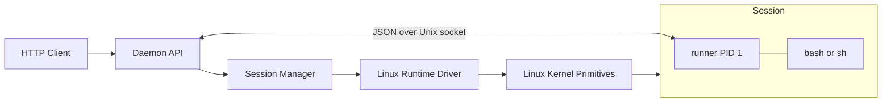
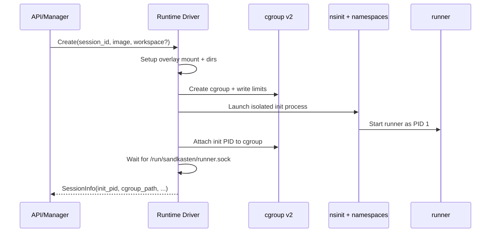

# Runtime Architecture Guide

This guide explains Sandkasten runtime architecture in depth, with focus on:

1. isolation and process model (namespaces, cgroups, PID 1, runner),
2. filesystem model (rootfs generation, overlay layers, workspace mounting, persistence).

It is intentionally low-level and maps concepts to concrete behavior in this repository.

---

## Chapter 1: Isolation, Process Model, and Control Plane

### 1.1 High-level runtime structure

Sandkasten has three core runtime actors:

- **Daemon (`sandkasten`)**: orchestrates sessions, API, store, pooling, reaper.
- **Linux runtime driver**: creates isolated environments using namespaces/cgroups/mounts.
- **Runner (`runner`)**: PID 1 inside the sandbox; exposes command/file RPC over Unix socket.



### 1.2 Namespaces used and why

For each session, Sandkasten creates isolated namespaces (via `nsinit` path):

- **mount namespace**: independent mount table per session.
- **pid namespace**: process IDs are private; runner is PID 1 inside the sandbox.
- **uts namespace**: hostname/domain isolation.
- **ipc namespace**: shared memory/semaphore/message queue isolation.
- **net namespace**: independent network stack (bridge/none/host behavior by config).
- **user namespace**: privilege mapping model to contain capabilities inside sandbox boundary.

Practical effect: session commands cannot directly see/control host process tree, host mounts, or host IPC primitives.

### 1.3 Cgroups v2 controls

Each session gets a dedicated cgroup. Sandkasten writes limits for:

- CPU (`cpu.max`),
- memory (`memory.max`),
- process count (`pids.max`).

Stats endpoint reads from cgroup files (`memory.current`, `cpu.stat`) to report:

- memory bytes,
- CPU usage in microseconds.

This is why benchmark CPU/memory numbers are attributed per session cleanly.

### 1.4 Why runner is PID 1

Runner runs as PID 1 in the sandbox PID namespace by design.

Why this matters:

- **single init authority** for child shell/processes,
- central place for signal handling and lifecycle,
- stable control point for daemon RPC (`runner.sock`).

PID 1 responsibility in this architecture:

- start and manage shell mode (stateful) or direct exec mode (stateless),
- serialize exec requests,
- return structured responses (exit code, duration, output, cwd),
- terminate cleanly on daemon/session destroy.

### 1.5 Session create pipeline (kernel-level view)



### 1.6 Stateful shell vs stateless exec

Runner supports two execution modes:

- **stateful mode**: persistent shell on PTY; cwd/env persists between execs.
- **stateless mode**: each exec runs direct command process; lower overhead, no shell state persistence.

Recent optimization replaced fixed startup sleeps with **marker-based shell readiness probes**, reducing cold startup significantly while preserving safe startup semantics.

### 1.7 Network setup model

Network mode behavior depends on config:

- `bridge`: per-session namespace network, with lazy setup on first exec.
- `none`: no network setup.
- `host`: host network behavior.

Lazy setup avoids paying full network initialization on create when no command is executed yet.

### 1.8 Security posture summary

Isolation is layered:

- namespaces (visibility and containment),
- cgroups (resource containment),
- readonly rootfs option,
- seccomp profile modes,
- socket-level control path rather than arbitrary host shelling.

This is defense-in-depth, not single-mechanism isolation.

---

## Chapter 2: Filesystem Architecture, RootFS Generation, and Layers

### 2.1 Image representation

Sandkasten images live under data dir (`<data_dir>/images/<name>`), with rootfs content and metadata.

When imported/pulled from OCI, layered metadata may be materialized under `<data_dir>/layers/...` and composed into overlay lowerdirs.

### 2.2 Per-session filesystem layout

Each session gets its own writable overlay structures:

```text
<data_dir>/sessions/<session_id>/
  upper/       # writable copy-on-write layer
  work/        # overlayfs internal workdir
  mnt/         # merged mountpoint (session root)
  run/         # host bind for /run/sandkasten (runner.sock)
  state.json   # runtime state (init PID, cgroup path, mnt, sock)
```

### 2.3 Overlayfs composition

```mermaid
flowchart TD
    L1[Image lower layers readonly] --> M[Overlay merged root mnt]
    U[Session upper writable] --> M
    W[Session workdir] --> M
    M --> Sandbox[/ inside sandbox]
```

Semantics:

- Reads prefer `upper`, then fall through to lower layers.
- Writes create/modify entries in `upper` (copy-on-write).
- Lower layers stay immutable.

Destroying a session deletes its `upper/work/mnt`, so non-workspace writes disappear.

### 2.4 Rootfs setup steps

During create, runtime driver performs roughly:

1. resolve lower layer chain for selected image,
2. create `upper/work/mnt` session dirs,
3. mount overlay to `mnt`,
4. prepare critical mounts (`/run/sandkasten`, `/tmp`, minimal `/dev`),
5. apply optional readonly remount,
6. launch namespaced init/runner.

This happens before the API returns session created.

### 2.5 Workspace mount model

If `workspace_id` is provided and workspace is enabled:

- host path `<data_dir>/workspaces/<workspace_id>` is used,
- mounted as `/workspace` inside session.

With workspace-aware pooling, sessions can now be prewarmed for `(image, workspace_id)` directly, avoiding late remount penalties on readonly roots.

### 2.6 What persists and what does not

| Path | Backing | Persist after destroy |
|---|---|---|
| `/workspace` with workspace_id | host workspace dir | Yes |
| `/workspace` without workspace_id | session overlay upper | No |
| `/usr`, `/etc`, `/opt` writes | session overlay upper (if writable) | No |
| `/tmp` | tmpfs | No |
| `/home/sandbox` | tmpfs | No |

### 2.7 Where package installs go (`pip install` examples)

Behavior depends on install target:

- default global install path -> overlay upper (ephemeral per session, subject to readonly policy),
- install inside `/workspace` (venv/target) -> persistent with workspace,
- install in tmpfs locations -> ephemeral.

Recommended for agent workflows:

- create venv in `/workspace/.venv`,
- install dependencies there,
- reuse same `workspace_id` across sessions.

### 2.8 Readonly rootfs and write behavior

If `readonly_rootfs: true`:

- core root tree is remounted readonly,
- write-heavy operations outside writable mounts fail by design,
- workspace remains writable when mounted as dedicated path.

This enforces stronger immutability while still allowing project state via workspace.

### 2.9 Session teardown and garbage collection

On destroy/reap:

- runner/init process terminated,
- cgroup removed,
- mounts detached,
- session directory removed,
- workspace directory preserved unless explicitly deleted.

Pool idle sessions are tracked separately (`pool_idle`) and managed by refill logic.

---

## Chapter 3: How to Reason About Performance from Architecture

Cold start includes:

- overlay setup + mount ops,
- cgroup + namespace setup,
- runner boot and socket readiness.

Warm pooled start includes mainly:

- pool acquire + state transition + TTL update.

That architectural delta explains benchmark patterns like:

- cold tens/hundreds of ms,
- warm sub-ms to few ms.

Workspace-aware pools reduce warm workspace startup to warm-none territory by reusing already-matched entries.

---

## Chapter 4: Suggested Reading Path in Repo

- Runtime driver internals: `internal/runtime/linux/driver.go`, `internal/runtime/linux/mount.go`
- Session orchestration: `internal/session/create.go`, `internal/session/manager.go`
- Pool logic: `internal/pool/pool.go`
- Runner behavior: `cmd/runner/server.go`, `cmd/runner/exec.go`
- Workspace API and behavior: `docs/features/workspaces.md`
